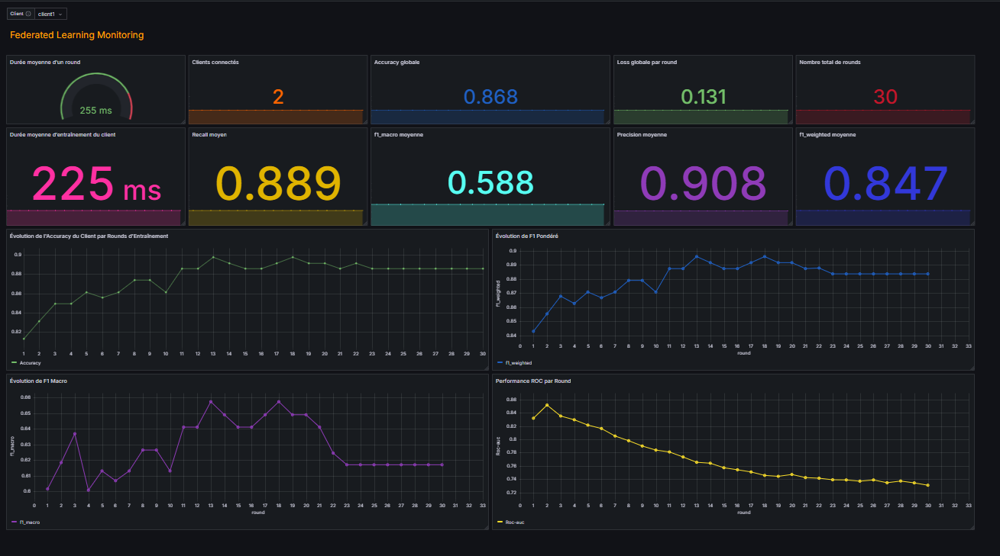

# Federated Kidney Diagnosis 

A Federated Learning system for early diagnosis of Chronic Kidney Disease (CKD) using Flower, Docker, Prometheus, and Grafana.

## 🚀 Overview

This project implements a federated learning architecture to detect chronic kidney disease early using a distributed dataset. It simulates multiple clients (e.g., hospitals or labs) that collaboratively train a model **without sharing raw patient data**.

Key technologies:

* 🧠 **Flower** (FL framework)
* 🐍 **Scikit-learn** & **MLPClassifier** for the model
* 🐳 **Docker** & `docker-compose` for orchestration
* 📊 **Prometheus & Grafana** for monitoring and visualization

---

## 📁 Project Structure

```
federated-kidney-diagnosis/
├── client1/            # First FL client
|   ├──app/               
│      ├── client.py
|      ├── utils.py           
│   ├── dataset
|      ├── client1_data.csv
│   |── Dockerfile
│   └── requirements.txt
├── client2/            # Second FL client
|   ├──app/               
│      ├── client.py
|      ├── utils.py           
│   ├── dataset
|       ├── client2_data.csv
│   |── Dockerfile
│   └── requirements.txt
├── server/                # FL server logic
│   ├── server.py
|   |── Dockerfile
│   └── requirements.txt
├── monitoring/
│   ├── prometheus/
│   │   └── prometheus.yml
│    
├── docker-compose.yml     # Multi-container orchestration
└── README.md             
```

---

## ⚙️ How It Works

* **Each client** loads its own version of the CKD dataset and trains a model locally.
* **The server** coordinates training rounds using **FedAvg** aggregation.
* **Prometheus** collects metrics from clients and server.
* **Grafana** visualizes the system's performance and metrics in real-time.

---

## 🧪 Installation & Usage

### 1. Clone the repository

```bash
git clone https://github.com/OumaimaTF/federated-kidney-diagnosis.git
cd federated-kidney-diagnosis
```

### 2. Build and run the system

```bash
docker-compose up --build
```

> All components (server, clients, Prometheus, Grafana) will start in isolated containers.

### 3. Access dashboards

* 📈 Prometheus: [http://localhost:9090](http://localhost:9090)
* 📋 Grafana: [http://localhost:3000](http://localhost:3000)

  * Login: `admin` / `admin`

---

## 📊 Grafana Dashboard Example

> Visualize training loss, accuracy, number of rounds, etc.



---

## 📚 Dataset

Used: [Chronic Kidney Disease Dataset (Kaggle)](https://www.kaggle.com/datasets/rabieelkharoua/chronic-kidney-disease-dataset-analysis/data)

---


## 🧭 Execution Plan

This is a brief overview of how the system runs:

1. **Infrastructure Startup** via Docker Compose:
   - Starts the Flower server
   - Launches two FL clients simulating medical centers
   - Starts Prometheus, Grafana, and Pushgateway for monitoring

2. **Federated Learning Setup**:
   - Each client registers with the server
   - The server orchestrates training rounds using the FedAvg aggregation algorithm

3. **Local Training & Aggregation**:
   - Each client trains an `MLPClassifier` on its local CKD dataset
   - Model weights are sent to the server for aggregation

4. **Metrics Monitoring**:
   - Clients and server push custom training metrics via Prometheus Pushgateway
   - Grafana visualizes metrics like accuracy, loss, and round number in real time

5. **Shutting Down**:
   - To gracefully stop all containers:
     ```bash
     docker-compose down
     ```

---


## 🏗️ Built With

* [Flower](https://flower.dev/)
* [Scikit-learn](https://scikit-learn.org/)
* [Docker](https://www.docker.com/)
* [Prometheus](https://prometheus.io/)
* [Grafana](https://grafana.com/)

---

## 🧑‍💻 Author

**Oumaima Toufali**

* GitHub: [@OumaimaTF](https://github.com/OumaimaTF)
  

---
